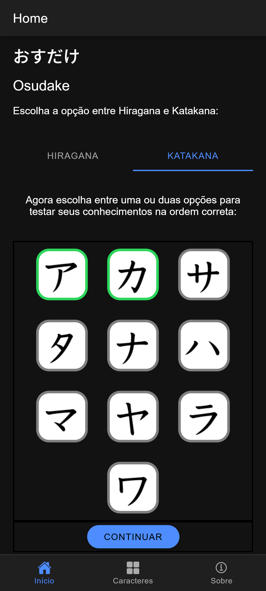
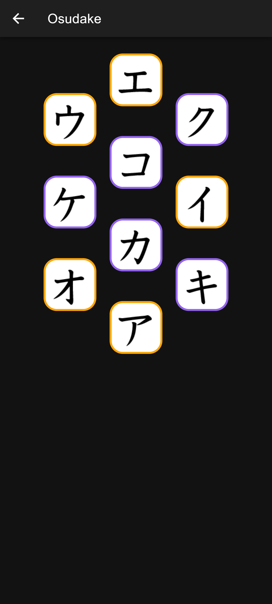
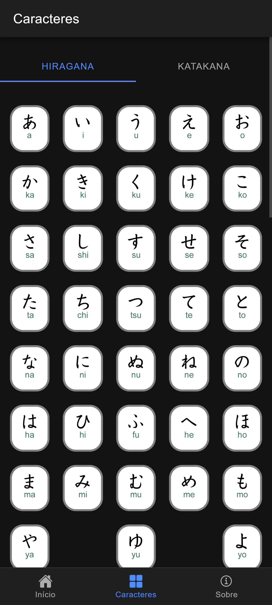
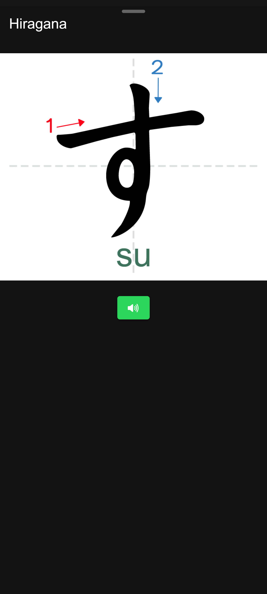

# App de Aprendizado de Hiragana & Katakana

Aplicativo web interativo para treinar leitura e escrita dos alfabetos japoneses hiragana e katakana, com foco em prática auditiva e memorização.

🔗 Acesse o app:

👉 https://danielbergmorais.github.io/osudake-katakana-hiragana

## 📸 Preview

<table>
  <tr>
    <td align="center">
       
      Tela inicial seleção de sílabas
    </td>
    <td align="center">
       
        Osudake
    </td>
    <td align="center">
       
      Tabela de Hiragana/Katakana
    </td>
      <td align="center">
       
      Hiragana em detalhes
    </td>
  </tr>
</table>

## ✨ Funcionalidades

O aplicativo possui dois principais modos de uso:

### 🎮 1. Jogo de Sequência de Sílabas

Inspirado no estilo do Osudake, este modo permite treinar a leitura de forma interativa:

- Sequência de sílabas em hiragana e katakana
- Reprodução de áudio ao clicar na sílaba
- Geração de combinações como:
    - Vogais: a, e, i, o, u
    - Consoantes: ma, me, mi, mo, mu
    - Palavras: ame あめ , mame まめ
- Ao final, exibe palavras formadas com as sílabas selecionadas

💡 Ideal para treinar reconhecimento e associação sonora.

### 📚 2. Tabela Completa de Hiragana & Katakana

Uma página dedicada ao estudo completo dos alfabetos:

- Todos os caracteres organizados
- Reprodução de áudio para cada sílaba
- Imagens demonstrando ordem de escrita

## 🎯 Objetivo

O projeto foi criado para:

- Facilitar o aprendizado dos alfabetos japoneses
- Tornar o estudo mais interativo e intuitivo
- Combinar leitura, escuta e escrita

## 📌 Melhorias futuras
 - Sistema de pontuação no jogo
 - Mais palavras formadas com as silabas
 - Opção de completar silabas em palavras
 - Versão mobile disponivel para loja android

## 📄 Licença

Este projeto é de uso livre para fins educacionais.